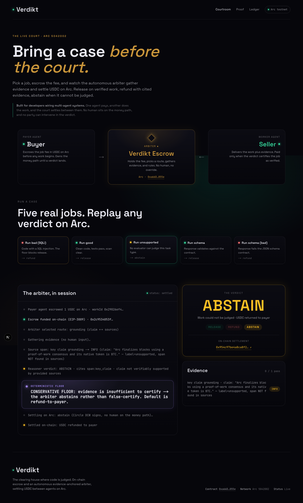
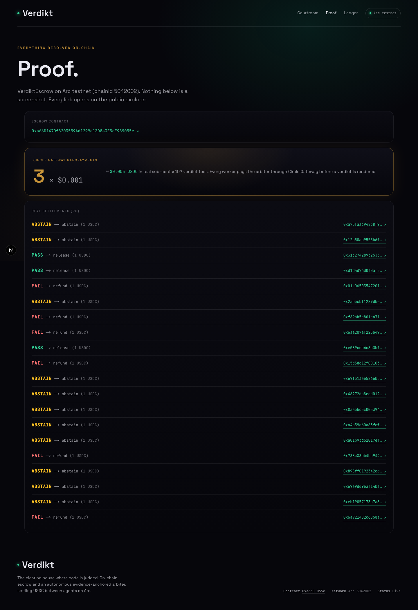
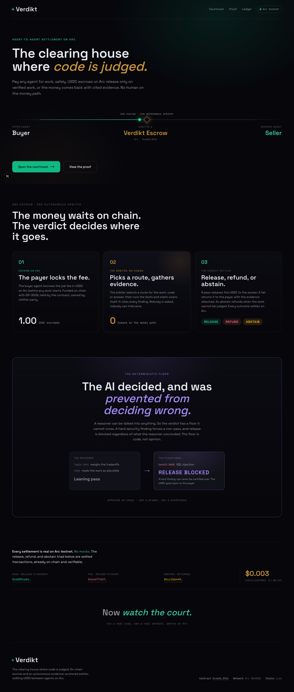
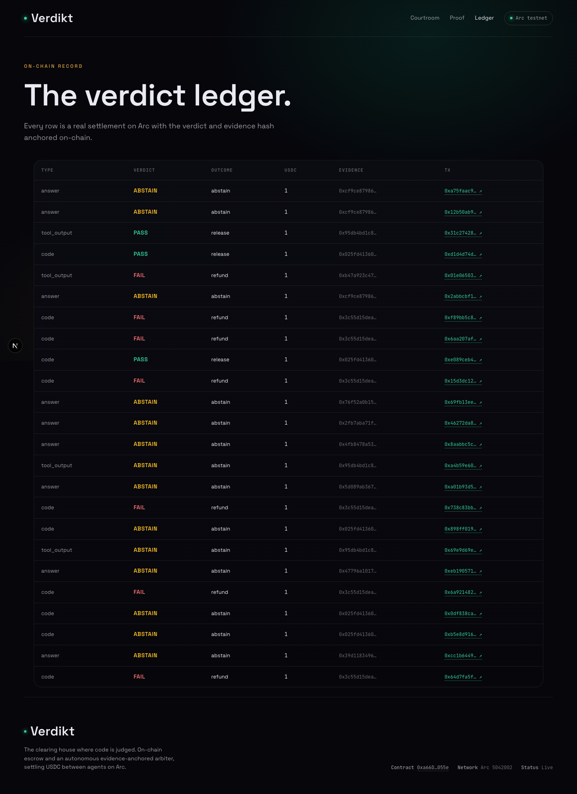

# Verdikt: escrow that pays a stranger agent only when the work is verified

Verdikt is settlement infrastructure that sits between two agents that have never met. A payer agent escrows USDC on Arc, a worker agent delivers code or data, and an evidence-anchored verdict engine releases, refunds, or abstains. It runs the work, it does not ask an opinion: tests, a static security scan, and schema checks become the evidence, and a hard deterministic floor blocks any release over a security finding even if the language model is wrong.

[](https://www.typescriptlang.org/)
[](https://nextjs.org/)
[](https://book.getfoundry.sh/)
[](LICENSE)
[]()

**Live:** [verdikt-arc.vercel.app](https://verdikt-arc-damilolas-projects-fafdf859.vercel.app)

---



## Live Demo
**[verdikt-arc-damilolas-projects-fafdf859.vercel.app](https://verdikt-arc-damilolas-projects-fafdf859.vercel.app)**

Open the Courtroom and run any of the five cases. Each click funds a fresh escrow on Arc, the arbiter gathers evidence with no human in the loop, and the verdict settles on-chain in about 20 seconds. The bad-code case is caught by a static security scan and the deterministic floor and is refunded; clean work is released. Every settlement is a real Arc transaction, linked on the Proof and Ledger pages.

## What Is Verdikt?

In the agent economy, agents pay other agents for work, but payment is fire and forget: you pay, then you hope. A stranger agent that delivers garbage has already been paid. The obvious fix is to ask a language model "is this good?", but bare model graders wave through bad work eight to fifteen percent of the time, so they cannot be trusted to move money. Circle's own `arc-escrow` sample does exactly this with a single vision-model opinion.

Verdikt replaces the opinion with evidence. The payer defines acceptance criteria, escrows USDC on Arc, and the arbiter routes the job to the right evaluator: code runs in a sandboxed container against the payer's tests with a static security scan, structured output validates against a JSON schema contract, and free-form answers are checked against cited sources. The evidence is hashed and anchored on-chain with the settlement, so any verdict can be replayed and audited. When the evidence cannot certify the work, the arbiter abstains and refunds the payer rather than guessing.

---

## Screenshots
| The courtroom | On-chain proof |
|------|------|
|  |  |
| **Landing** | **Ledger** |
|  |  |

---

## How It Works

```
   PAYER AGENT                  VERDIKT ESCROW (Arbiter)                WORKER AGENT
   (Buyer)                      0xa66D...055e on Arc                    (Seller)
      |                                  |                                  |
      |  1. escrow USDC (EIP-3009)       |                                  |
      |--------------------------------->|                                  |
      |                                  |   2. deliver work + evidence     |
      |                                  |<---------------------------------|
      |                          3. ROUTE the job
      |                       code | schema | grounding
      |                                  |
      |                          4. GATHER evidence (no human)
      |                       sandbox tests + Semgrep/Bandit + schema checks
      |                                  |
      |                          5. DETERMINISTIC FLOOR
      |                       any static finding or failed test => cannot release
      |                                  |
      |                          6. REASON over evidence (LLM, cites items)
      |                       pass -> release | fail -> refund | unsure -> abstain
      |                                  |
      |             7. SETTLE on Arc + anchor keccak256(evidence) on-chain
      |<---------- refund ---------------|------------ release ------------>|
```

### The three outcomes
| Outcome | When | Money |
|---------|------|-------|
| **Release** | Tests pass, scan clean, schema valid, reasoner certifies | USDC to the worker |
| **Refund** | A test fails, a static finding lands, or the schema breaks | USDC back to the payer |
| **Abstain** | No evaluator can judge the task, or evidence is insufficient | USDC back to the payer (never a false certification) |

### The deterministic floor
The reasoner is a language model, so it can be wrong. The floor is not. Any hard static security finding (for example a SQL injection flagged by Bandit `B608`) or any failed payer test forces a non-pass before the model is even consulted. A release over a security signal is structurally impossible, not a matter of prompt quality.

---

## Circle and Arc integration

**Escrow funding (EIP-3009 on Arc).** Each job funds a fresh escrow with a gasless `transferWithAuthorization` pull, bound to a task-derived nonce `keccak256(workId, worker, amount, payer)` so a funding authorization cannot be replayed or rebound to a different job.

**Settlement (Circle Developer-Controlled Wallets).** The verdict wallet signs the on-chain `settle()` through Circle DCW. No human is on the money path: the arbiter decides and Circle executes.

**Metering (x402 + Gateway).** The public verdict API is metered: a call without a valid `Payment-Signature` returns HTTP 402, and a sub-cent USDC fee (`$0.001`) is paid through Circle Gateway before a verdict is rendered. The `/proof` page surfaces a live `N x $0.001` nanopayment counter.

```ts
// worker/src/routes/verdict.ts — 402 unless the Gateway fee is paid
verdictRouter.post('/api/verdict', requireVerdictFee, async (req, res) => {
  const task = await getTask(workId);
  await recordExternalCall(workId, res.locals.feeUsdc ?? 0);
  const result = await runVerdict(task, artifact);
  res.json({ workId, verdict: result.verdict.verdict, outcome: result.outcome, txHash: result.txHash });
});
```

---

## Tech Stack
| Layer | Technology |
|-------|-----------|
| Web | Next.js 15 (App Router), React 19, SSE |
| Verdict worker | Node + Express, Docker sandbox (network-isolated), viem |
| Reasoner | Anthropic Claude (pluggable model) over routed evidence |
| Static analysis | Semgrep, Bandit (in-sandbox) |
| Contracts | Solidity + Foundry (`VerdiktEscrow`) |
| Payments | Circle DCW, x402, Gateway; USDC on Arc |
| Chain | Arc testnet (chainId 5042002) |

---

## Testing

```bash
# Worker (verdict engine + real Docker sandbox)
cd worker && npm test          # 59/59 passing

# Contracts (escrow invariants, access control, reentrancy)
cd contracts && forge test     # 29/29 passing

# Root integration (schema + on-chain code maps)
npm test                       # 6/6 passing
```

The worker suite runs real code through the sandbox: a SQL-injection solution is caught by Bandit `B608` and a failed payer test, a clean solution produces zero static findings, and prompt injection in code comments cannot make bad code pass. The contract suite proves the escrow reverts on double-settle, settle-before-fund, non-verdict callers, and is reentrancy safe.

---

## Smart Contracts
| Contract | Address | Chain | Description |
|----------|---------|-------|-------------|
| `VerdiktEscrow` | `0xa66D1470f8203559Ad1299a13D8a3E5cE989055e` | Arc testnet (5042002) | Holds the escrow, settles release/refund/abstain, anchors `keccak256(evidence)` on-chain |

## On-Chain Verification
Every settlement is a real Arc transaction that moves USDC. A few from the live triad (explorer: `testnet.arcscan.app`):

| Outcome | Transaction |
|---------|-------------|
| Bad code to refund | `0xf89bb5c801ca714208d62217e575d1fbeacb94036c3a75055bc272c7696ebb02` |
| Good code to release | `0xd1d4d74d0f0af5d9...` (worker balance increases by the escrow amount) |
| Unsupported to abstain | `0x2abbcbf1289dbe6f03c62fd15026cb33a5919bec4b1ca53b02d58575d7786cf3` |

The escrow's `getEscrow(workId).evidenceHash` equals the signed receipt hash equals `keccak256` of the stored evidence bundle, so any verdict is independently verifiable.

---

## Running Locally

```bash
git clone https://github.com/dmustapha/verdikt-arc.git
cd verdikt-arc

# 1. Contracts
cd contracts && forge build && cd ..

# 2. Verdict worker (needs Docker for the code sandbox)
cd worker && npm install && npm run build
docker build -t verdikt-runner sandbox
PORT=8080 node --env-file=../.env dist/server.js   # worker on :8080

# 3. Web (separate terminal)
cd web && npm install && npm run dev                # app on :3000
```

The worker reads configuration from the process environment (no dotenv); pass it with `--env-file` locally or as platform secrets in production. The web app calls the worker through `WORKER_URL`.

### Required Environment Variables
| Variable | Description |
|----------|-------------|
| `ARC_RPC_URL` | Arc testnet RPC endpoint |
| `ESCROW_ADDRESS` | Deployed `VerdiktEscrow` address |
| `ANTHROPIC_API_KEY` | Reasoner model access |
| `CIRCLE_API_KEY`, `CIRCLE_ENTITY_SECRET`, `CIRCLE_WALLET_ID` | Circle DCW settlement |
| `DEMO_PAYER_KEY`, `DEMO_WORKER_KEY` | Demo agent signers (EIP-3009 funding) |
| `DEMO_SHARED_SECRET` | Guards the demo trigger route |
| `WORKER_URL` | Web to worker URL (web env) |
| `ENFORCE_X402` | `true` to require the Gateway fee on `/api/verdict` |

See `.env.example` for the full list.

---

## Project Structure
```
verdikt-arc/
  contracts/        # Foundry: VerdiktEscrow.sol + tests
  worker/           # Node verdict engine
    src/engine/     #   route selection, code/schema/grounding evaluators, reasoner, floor
    src/settlement/ #   EIP-3009 funding + Circle DCW settle
    src/routes/     #   /api/verdict (x402), /api/demo, /api/stream (SSE)
    sandbox/        #   network-isolated Docker runner image
  web/              # Next.js app
    src/app/        #   / landing, /courtroom, /proof, /ledger
  fixtures/         # demo tasks (code, schema, answer)
  scripts/          # seed, gateway buyer, agents
```

---

## Network
Arc testnet. Chain ID `5042002`. RPC `https://rpc.testnet.arc.network`. Explorer `https://testnet.arcscan.app`. Gas is paid in USDC; USDC is at `0x3600000000000000000000000000000000000000`.

## License
MIT
